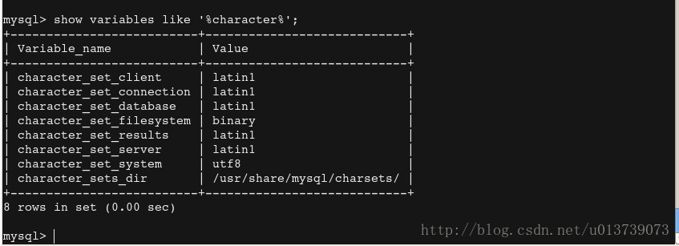

使用的远程连接工具SecureCRT。

## 一、mysql

1.如果是第一次开启，需要更新一下。

```
root@iZwz98t5oy5hkarmcng9qnZ:~# sudo apt-get update
```
2.安装mysql

```
root@iZwz98t5oy5hkarmcng9qnZ:~# sudo apt-get install mysql-server mysql-client
```
3.安装过程中，会有两次输入用户名和密码的操作。
4.安装完成之后，检测是否安装成功：
     登录mysql服务器：
 

```
root@iZwz98t5oy5hkarmcng9qnZ:~# mysql -u root -p
```
如果出现如下内容表示安装成功。

```
Welcome to the MySQL monitor.  Commands end with ; or \g.
Your MySQL connection id is 17679
Server version: 5.5.54-0ubuntu0.14.04.1 (Ubuntu)

Copyright (c) 2000, 2016, Oracle and/or its affiliates. All rights reserved.

Oracle is a registered trademark of Oracle Corporation and/or its
affiliates. Other names may be trademarks of their respective
owners.

Type 'help;' or '\h' for help. Type '\c' to clear the current input statement.

mysql> 

```
exit/quit退出mysql数据库。

5.修改数据库编码问题

查看数据库系统变量及其值：

```
mysql> show variables like '%character%';
```
正常情况下是这样：

```
+--------------------------+----------------------------+
| Variable_name            | Value                      |
+--------------------------+----------------------------+
| character_set_client     | utf8                       |
| character_set_connection | utf8                       |
| character_set_database   | utf8                       |
| character_set_filesystem | binary                     |
| character_set_results    | utf8                       |
| character_set_server     | utf8                       |
| character_set_system     | utf8                       |
| character_sets_dir       | /usr/share/mysql/charsets/ |
+--------------------------+----------------------------+
```
如果出现以下情况需要修改配置文件


编辑mysql的配置文件：

```
root@iZwz98t5oy5hkarmcng9qnZ:~# vim /etc/mysql/my.cnf
```
在[client]下加入default-character-set=utf8
在[mysqld]下加入character-set-server=utf8
在[mysql]下加入default-character-set=utf8

保存后重启mysql

```
root@iZwz98t5oy5hkarmcng9qnZ:~# service mysql restart
```
同时inert多条数据时，从第二条开始中文还是会乱码，该问题暂未解决。

6.设置允许远程访问mysql数据库

(1) 编辑数据库的配置文件
```
vim /etc/mysql/my.cnf
```
找到bind-address = 127.0.0.1，注释掉，换为bind-address    = 0.0.0.0，表示允许任意IP访问。

```
#bind-address           = 127.0.0.1
bind-address    = 0.0.0.0
```
(2) 重启mysql。
(3) 授权用户远程访问数据库

```
mysql> GRANT ALL PRIVILEGES ON *.* TO 'root'@'%' IDENTIFIED BY 'password' WITH GRANT OPTION;
```
root是用户名，%表示所有电脑都能连接，password是远程连接时的密码。表示所有数据库里的所有表都授权给该用户。

刷新权限信息，让刚才的配置生效。
```
mysql> flush privileges;
```
这样就可以在本地操作服务器上的数据库了。

## 二、ubuntu 18.04 安装mysql

sudo apt install mysql-server默认会安装MySQL 5.7，将会出现一些莫名的问题，例如：安装过程没有要求输入root密码，而登录mysql时会要求密码，就会登录不成功。
ubuntu 18.04 支持安装mysql8.0以上的版本，以下为安装mysql8.0版本的说明：

1.[oracle](https://dev.mysql.com/downloads/file/?id=477124)官网下载`mysql-apt-config_0.8.10-1_all.deb`文件，上传至服务器`/home/用户`目录下;
2.远程登录服务器，安装下载的配置包：
```
sudo dpkg -i mysql-apt-config_0.8.10-1_all.deb
```
在弹出的选择框中选择`OK`，等待执行完毕.
3.更新系统：
```
sudo apt-get update
```
4.安装mysql：
```
sudo apt-get install mysql-server 
```
在安装过程中输入密码，这里有一步需要选择加密的方式，注意选择5.*版本 。
5. 启动mysql服务：
```
service mysql start
```
6.设置数据库允许远程登录
(1) 首先进入mysql数据库：`mysql -u root -p`
(2) 使用名字为mysql的数据库：`use mysql`
(3) 查询每个用户的访问权限：`select User,Host from mysql.user;`，返回内容如下：
```
+------------------+-----------+
| User             | Host      |
+------------------+-----------+
| mysql.infoschema | localhost |
| mysql.session    | localhost |
| mysql.sys        | localhost |
| root             | localhost |
+------------------+-----------+
4 rows in set (0.00 sec)
```
(4) 将root用户的Host修改为%，或新建一个Host为%的用户，即可以通过该用户远程登录。如下：
```
update user set host=’%’ where user=’root’; 
flush privileges;
```
或
```
CREATE USER 'username'@'host' IDENTIFIED BY 'password';
GRANT all privileges ON *.* TO `用户名`@`host` with grant option;
update mysql.user set plugin = 'mysql_native_password' where user = '用户名';
flush privileges;
```
7.修改Mysql的其他配置
进入` /etc/mysql/mysql.conf.d/mysqld.cnf `
(1) 允许最大连接数 增加`max_connections=1000`
(2) group by错误：增加`sql_mode=STRICT_TRANS_TABLES,NO_ZERO_IN_DATE,NO_ZERO_DATE,ERROR_FOR_DIVISION_BY_ZERO,NO_ENGINE_SUBSTITUTION`
(3) 大小写不敏感：增加`lower_case_table_names=1`，该项修改后，重启mysql会出错，解决办法：将数据库数据存储目录下的所有文件删除后重新启动mysql就可以成功了。
原因：该属性只有在mysql数据库初始化之前设置才会生效。
(4) windows环境下设置大小写不敏感
1）停止服务：net stop mysql
2）Mysql8的配置文件在目录C:\ProgramData\MySQL\MySQL Server 8.0下，修改my.ini文件，在【mysqld】下增加lower_case_table_names=2
3）保存后，重启数据库提示失败，此时需要将路径C:\ProgramData\MySQL\MySQL Server 8.0\Data下的文件全部删除，以管理员身份重新打开cmd，依次执行mysqld –initialize，mysqld-install，net start mysql，数据库启动成功
4）初始化数据库之后，会生成一个随机的root密码，如果要登录数据库需要重置密码：
关闭数据库：net stop mysql；
以管理员身份打开cmd，执行mysqld --shared-memory --skip-grant-tables，此时没有任何响应；
新打开一个cmd窗口，直接运行mysql，进入数据库后执行“FLUSH PRIVILEGES;”；再执行“ALTER USER 'root'@'localhost' IDENTIFIED BY ‘password’;”即可

## 三、ubuntu下忘记mysql密码

1. 修改数据库配置文件：
	```
	sudo vim /etc/mysql/mysql.conf.d/mysqld.cnf
	```
	增加`skip-grant-tables`，表示允许用户免密登录；
2. 重启mysql服务：
	```
	service mysql restart
	```
3. 在终端输入mysql即可进入数据库；
4. 将root或其他用户密码修改为空：
	```
	 update mysql.user set authentication_string='' where user='root'；
	 flush privileges;
	```
	执行完毕后推出数据库：`exit;`
5. 将`/etc/mysql/mysql.conf.d/mysqld.cnf`中步骤一中增加的配置删除，重启mysql服务；
6. 重新登录mysql服务：
	```
	mysql -u root
	```
7. 修改用户密码：
	```
	alter user 'root'@'localhost' identified by 'new_password';
	```

## 四、 修改数据库数据存储目录

 查看当前数据存储目录：`select @@datadir;`，返回如下结果。此时需要将数据存储目录修改为`/home/data/mysql`，操作如下：
```
	+-----------------+
	| @@datadir       |
	+-----------------+
	| /var/lib/mysql/ |
	+-----------------+
	1 row in set (0.00 sec)
```
1. 为了确保数据的完整性，我们将在实际更改数据目录之前关闭MySQL：
	```
	sudo systemctl stop mysql
	```
2. 将现有数据库目录复制到新位置：
	```
	sudo rsync -av /var/lib/mysql /home/data
	```
3. rsync完成后，使用.bak扩展名重命名当前文件夹并保留，直到我们确认移动成功为止：
	```
	sudo mv /var/lib/mysql /var/lib/mysql.bak
	```
4. 修改数据库配置文件中的datadir为新目录：
	```
	vim /etc/mysql/mysql.conf.d/mysqld.cnf   
	```
修改以下配置：
	```
	datadir = /home/data/mysql
	```
5. 配置AppArmor访问控制规则：
	```
	vim /etc/apparmor.d/tunables/alias
	```
在文件的底部增加：
	```
	alias /var/lib/mysql/ -> /home/data/mysql/,
	```
6. 要使更改生效，请重新启动AppArmor：
	```
	sudo systemctl restart apparmor
	```
7. 重启MySQL：
	```
	service mysql restart
	```
8. 注意：mysql的配置文件的访问权限一定要为644，如果为777，mysql重启会失败。

## 五、mysql卸载
1. 查看mysql的所有依赖：
	```
	dpkg --list|grep mysql
	```
2. 删除依赖：
	```
	sudo apt-get remove mysql-*
	```
3. 查看残留文件：
	```
	dpkg -l |grep ^rc|awk '{print $2}' |sudo xargs dpkg -P
	```

## 六、ubuntu下mysql安装布局
```
/usr/bin                  客户端程序和mysql_install_db
/var/lib/mysql            数据库和日志文件
/var/run/mysqld           服务器
/etc/mysql                配置文件my.cnf
/usr/share/mysql          字符集，基准程序和错误消息
/etc/init.d/mysql         启动mysql服务器
```

## 七、jdk
1. 在[http://www.Oracle.com/technetwork/Java/javase/downloads/index-jsp-138363.html](http://www.Oracle.com/technetwork/Java/javase/downloads/index-jsp-138363.html) 上下载需要的jdk，我下载的是jdk-8u131-linux-x64.tar.gz，上传到服务器中

2. 解压缩。将jdk解压到/usr/local目录下

	```
	root@iZwz98t5oy5hkarmcng9qnZ:~# tar zxvf jdk-8u131-linux-x64.tar.gz -C /usr/local
	```
3. 配置环境变量

(1) 编辑配置文件

```
root@iZwz98t5oy5hkarmcng9qnZ:~# vim /etc/profile
```
(2) 加入如下信息

```
#set java environment   
export JAVA_HOME=/usr/local/jdk1.8.0_131
export JRE_HOME=/usr/local/jdk1.8.0_131/jre  
export CLASSPATH=.:$JAVA_HOME/lib:$JRE_HOME/lib:$CLASSPATH  
export PATH=$JAVA_HOME/bin:$JRE_HOME/bin:$JAVA_HOME:$PATH 
```
(3) 保存后执行

```
root@iZwz98t5oy5hkarmcng9qnZ:~# source /etc/profile 
```
(4) 验证：

```
root@iZwz98t5oy5hkarmcng9qnZ:~# java -version
```

如果出现如下信息表示安装成功

```
java version "1.8.0_131"
Java(TM) SE Runtime Environment (build 1.8.0_131-b11)
Java HotSpot(TM) 64-Bit Server VM (build 25.131-b11, mixed mode)
```

## 八、tomcat 
1.在官网上下载tar.gz格式的安装包。
2.解压到指定文件夹

```
root@iZwz98t5oy5hkarmcng9qnZ:~# tar -zxvf apache-tomcat-7.0.77.tar.gz -C /usr/local
```
3.进入到tomcat的bin目录下

```
root@iZwz98t5oy5hkarmcng9qnZ:~# cd /usr/local/apache-tomcat-7.0.77/bin/
```
执行

```
root@iZwz98t5oy5hkarmcng9qnZ:/usr/local/apache-tomcat-7.0.77/bin# vi setclasspath.sh
```
加入安装的jdk的信息

```
export JAVA_HOME=/usr/local/jdk1.8.0_131
export JRE_HOME=/usr/local/jdk1.8.0_131/jre 
```
保存即可。

在bin目录下启动tomcat服务器：

```
./startup.sh 
```

查看当前tomcat进程：

```
root@iZwz98t5oy5hkarmcng9qnZ:/usr/local/apache-tomcat-7.0.77/bin# ps -ef|grep tomcat
```
杀掉进程：kill -9 进程号
